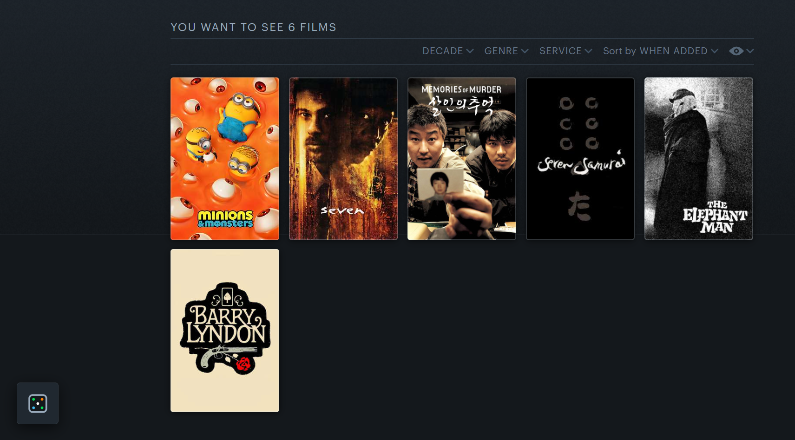
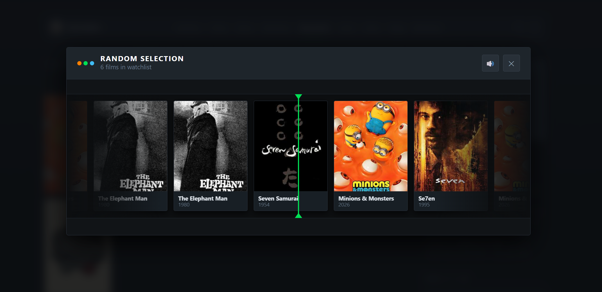
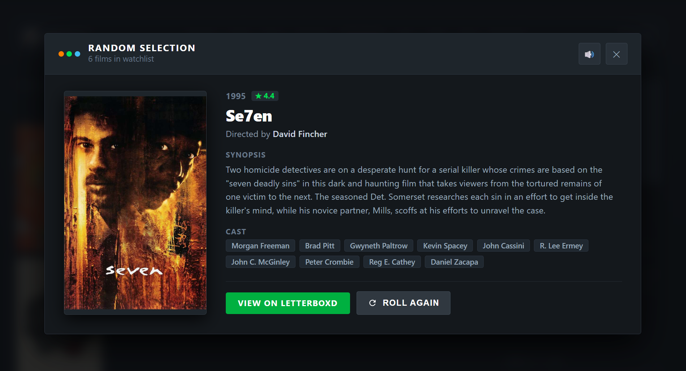
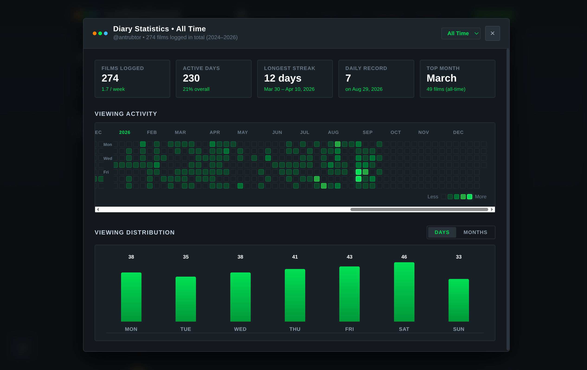

# 🎲 Letterboxd Companion (Watchlist Picker & Diary Stats)

A sleek, lightweight browser extension designed with **Letterboxd's authentic UI** that picks random movies from any watchlist with a smooth carousel animation, and visualizes your diary activity with GitHub-style heatmaps and comprehensive viewing statistics.

---

## ✨ Features

- 🎲 **Watchlist Random Picker**:
  - Discreet floating dice button on any watchlist page (`/watchlist/`).
  - Smooth animated roulette carousel reel with authentic mechanical clicking sound effects.
  - Winner reveal card with high-resolution poster, synopsis, director, cast, and Letterboxd rating.
- 📊 **Diary Statistics & Activity Heatmap**:
  - Statistics button on any diary page (annual e.g. `/diary/for/2026/` or all-time `/diary/`).
  - **GitHub-style Viewing Activity Heatmap**: 5-tier green color scale with hover tooltips detailing logged films for each day.
  - **All-Time Multi-Year Timeline**: Continuous calendar spanning your entire diary history with smooth horizontal scrolling and year markers.
  - **Summary Metrics**: Total Films Logged (and per-week average), Active Days (% of year / overall), **Longest Streak** (consecutive days with exact date range), Daily Record, and Top Month.
  - **Viewing Distribution**: Interactive bar charts toggling between weekday distribution (Monday to Sunday) and monthly trends (January to December).

---

## 📸 Screenshots

### 1. Watchlist Floating Button


### 2. Random Selection Reel


### 3. Movie Details Modal


### 4. Diary Activity Heatmap & Statistics


---

## 🚀 Quick Install (Single-File)

Download the packaged extension from the **[Releases](https://github.com/Antrubtor/LetterboxRNG/releases)** page and install it in seconds:

### Chrome / Brave / Edge / Opera
1. Download `letterboxd-watchlist-picker-vX.X.X.zip` from Releases.
2. Open `chrome://extensions/` and enable **Developer mode** (top-right toggle).
3. Drag & drop the downloaded `.zip` file directly into the page (or click **Load unpacked** / **Pack extension**).

### Firefox
1. Download `letterboxd-watchlist-picker-vX.X.X-firefox.xpi` (or `.zip`) from Releases.
2. Open `about:debugging#/runtime/this-firefox`.
3. Click **Load Temporary Add-on...** and select the `.zip` or `.xpi` file directly without extracting.

### Safari (macOS)
1. Download and unzip `letterboxd-watchlist-picker-vX.X.X.zip`.
2. In Safari > **Settings** > **Advanced**, check **"Show features for web developers"**.
3. In Safari > **Develop**, check **"Allow Unsigned Extensions"**.
4. In Terminal, run Apple's extension converter:
   ```bash
   xcrun safari-web-extension-converter /path/to/folder
   ```
5. Open the project in Xcode, click **Run** (`⌘R`), and enable the extension in Safari > **Settings** > **Extensions**.